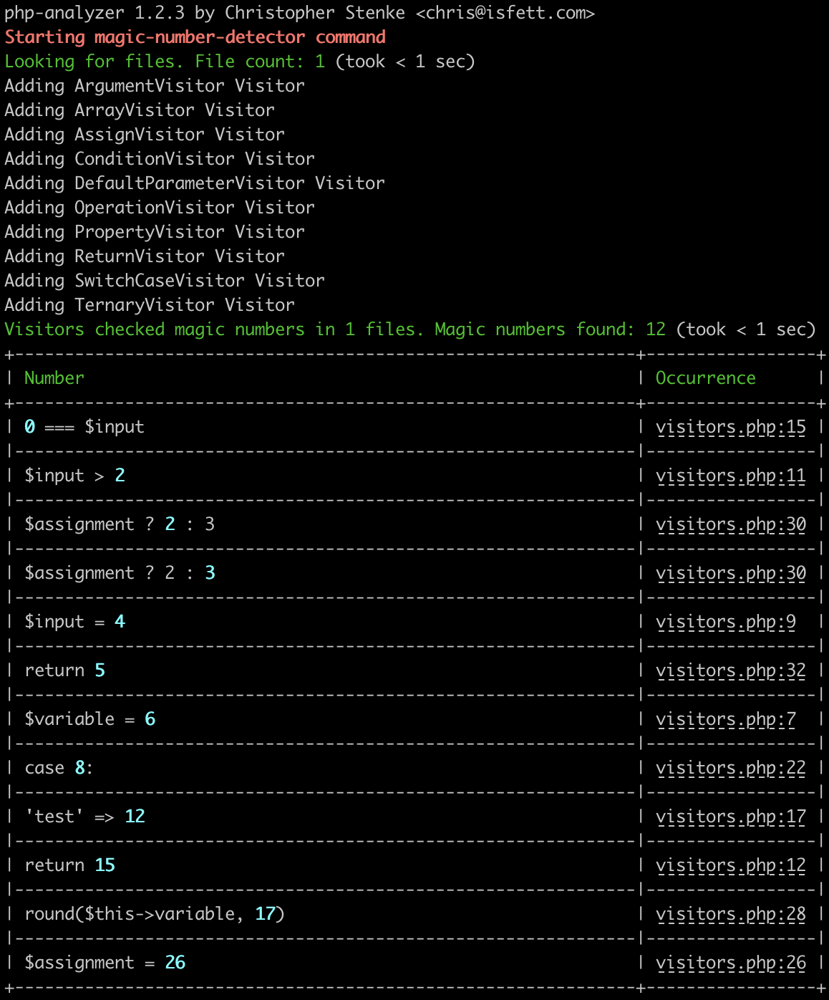
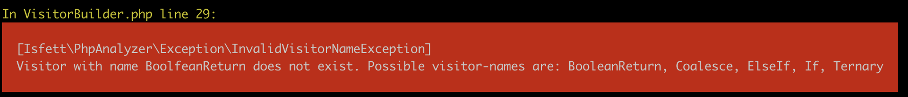
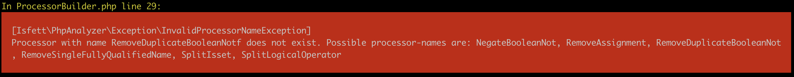

# Magic Number Detector

This Command help to find Magic Numbers in your code or in specific php language constructs (like just checking switch cases etc.). It can also ignore `1`, `0` and `-1` (if you want to). 

It can also be used on your deploying pipeline and cancel the build if Magic Numbers occur, see [Exit-Code](#exit-code).

### With this command you can:

- declare which directory (recursive) you want to inspect
- change the suffixes (default is just *.php)
- exclude directories/files/patterns
- whitelist patterns (if you just want to check one/some file/s)
- declare where you want Magic Numbers, for example just default parameters in functions or switch cases, see [Visitors](#visitors))
- post-process Magic Numbers (ignore `-1`,`0` or `1`, ignore define functions or assignments in for loops, see [Processors](#processors))

### Syntax

```shell script
# cloned repository, maybe via composer global require
bin/php-analyzer magic-number-detector [--options] directory

# phar
php-analyzer.phar mmagic-number-detector [--options] directory
```

If you omit the directory it will use the current working directory. You can use absolute or relative paths.

### Options

- `--excludes` to exclude directories. These must be relative to the source. Comma-separated list, for example: `--excludes=vendor,var`
- `--exclude-paths` to exclude paths. This option expects a comma-separated list. The list items could be a string or regexp, for example: `--exclude-paths=some/file.txt,some\/*\/dir`
- `--exclude-files` to exclude files. This option expects a comma-separated list. The list items could be a regexp, a [glob](https://www.php.net/glob) or string, for example: `--exclude-files=*Test.php`
- `--include-files` to include only specific files. This option expects a comma-separated list. The list items could be a regexp, a [glob](https://www.php.net/glob) or string. This is useful if you just want to inspect one to n files, for example `--include-files=test.php`
- `--suffixes` to change the suffixes of files getting inspected. The default is `php`, but maybe you want to add `phtml`, with: `--suffixes=php,phtml`
- `--visitors` to choose which Magic Numbers should be considered, see [Visitors](#visitors). The default is `Assign,Condition,DefaultParameter,Operation,Property,Return,SwitchCase`. If you just want to find Magic Numbers from switch cases, you can use easily `--visitors=SwitchCase`
- `--processors` to select how to post-process discovered Magic Numbers, see [Processors](#processors). The default is none, i.e. your Magic Numbers will be added in the form they appear in your source-code.
- `--sort` to determine the sorting direction. The list is sorted by the value of the Magic Number in the source code. The default sorting direction is `asc`. Change it to descending with `--sort=desc`

### Visitors
For example we have some code like [this](examples/MagicNumberDetector/visitors.php):

```php
<?php

class MagicNumberTestClass
{
    public const MAGICNUMBER = 3;

    private $variable = 6;

    public function test($input = 4)
    {
        if ($input > 2) {
            return 15;
        }

        if (0 === $input) {
            return  [
                'test' => 12,
            ];
        }
        
        switch ($input) {
            case 8:
                break;
        }

        $assignment = 26;
        
        $rounded = round($this->variable, 17);

        return 5;
    }
}
```

The following Visitors are available:
- `Argument`: This Visitor will collect all Magic Numbers inside arguments. In the above example, it would just add `17` once (argument from round)
- `Array`: This Visitor will collect all Magic Numbers inside arrays. In the above example, it would add `12` once (value from an array). The visitor will also report specific keys like in `$a[1234] = $user` (1234 is a Magic Number here)
- `Assign`: This Visitor will collect all Magic Numbers from assignments, here `26` 
- `Condition`: This Visitor will collect all Magic Numbers within conditions, here `0` (0 === $input) and `2` ($input > 2)
- `DefaultParameter`: This Visitor will collect all Magic Numbers from default parameters, here `4`
- `Operation`: This Visitor will collect all Magic Numbers within arithmetical operations. For example from `$seconds = 60*60*24` it will collect two times `60` and one time `24`
- `Property`: This Visitor will collect all Magic Numbers in class , here `6`
- `Return`: This Visitor will collect all Magic Numbers within return statements, here `5` and `15`
- `SwitchCase`: This Visitor will collect all Magic Numbers in switch cases, here `8`

`php bin/php-analyzer magic-number-detector --visitors=Argument,Array,Assign,Condition,DefaultParameter,Operation,Property,Return,SwitchCase --include-files=visitors.php docs/examples/MagicNumberDetector/`



**Important:** This tool uses a php-parser and ignores different code-styles, so it doesn't matter if you are using single-quotes or double-quotes, add different types or amount of whitespaces and so on. The printed representation may be diff from the real source code.

You can combine Visitors, use all or just one with a comma-separated list, like `--visitors=DefaultParamter,Return` or `--visitors=SwitchCase`.

If you mistype the name of a Visitor, you will raise an Exception which will list all possible names. Visitor names are case-sensitive.



(example from the [Most Used Conditions Command](/docs/MostUsedConditions.md), but will be the same with the Visitors of this command)

### Processors

You can combine Processors. Just add them to a comma-seperated list, like <br>`--processors=RemoveZero,RemoveOne,RemoveMinusOne`. The order of Processors is important. Using the provided example, processing would start with the SplitIsset and then execute SplitLogicalOperator. Your results might change if you change the order of the Processors.

You also can use none of the Processors (default).

If you mistype the name of a Processor, you will raise an Exception which will list all possible names. Processor names are case-sensitive.



(example from the [Most Used Conditions Command](/docs/MostUsedConditions.md), but will be the same with the Processors of this command)

The following Processors are available:
- `RemoveOne`: This Processor will remove all 1 (int) or 1.00 (float) values. We need them often in built-in php functions
- `RemoveZero`: This Processor will remove all 0 (int) or 0.00 (float) values. We need them often in built-in php functions
- `RemoveMinusZero`: This Processor will remove all -1 (int) or -1.00 (float) values. We need them often in built-in php functions
- `IgnoreDefineFunction`: This Processor will remove all Magic Numbers within the `define()` function
- `IgnoreForLoop`: This Processor ignore every Magic Number within a for loop head (like $i = 3; $i <= 10; $i++)

## Exit-Code
If at least one Magic Number was found the exit-code will be `1`. If no Magic Numbers were found, the exit-code will be `0`. So you can use it in your deployment/build script very easy.
