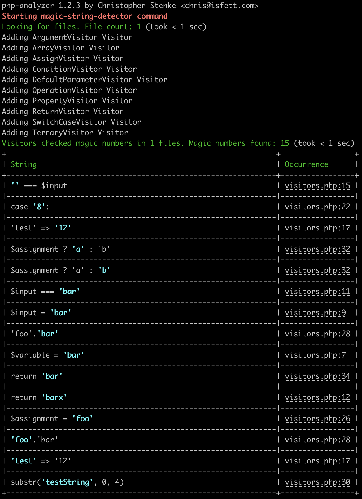

# Magic String Detector

This command helps to find Magic Strings in your code or in specific php language constructs (like just checking switch cases etc.). It can also ignore empty strings (if you want to). 

It can also be used on your deploying pipeline and cancel the build if Magic Strings occur, see [Exit-Code](#exit-code).

### With this command you can:

- declare which directory (recursive) you want to inspect
- change the suffixes (default is just *.php)
- exclude directories/files/patterns
- whitelist patterns (if you just want to check one/some file/s)
- declare where you want to check for Magic Strings, for example just default parameters in functions or switch cases, see [Visitors](#visitors))
- post-process Magic Strings (ignore `''`, ignore define functions or array keys, see [Processors](#processors))

### Syntax

```shell script
# cloned repository, maybe via composer global require
bin/php-analyzer magic-string-detector [--options] directory

# phar
php-analyzer.phar mmagic-string-detector [--options] directory
```

If you omit the directory it will use the current working directory. You can use absolute or relative paths.

### Options

- `--excludes` to exclude directories. These must be relative to the source. Comma-separated list, for example: `--excludes=vendor,var`
- `--exclude-paths` to exclude paths. This option expects a comma-separated list. The list items could be a string or regexp, for example: `--exclude-paths=some/file.txt,some\/*\/dir`
- `--exclude-files` to exclude files. This option expects a comma-separated list. The list items could be a regexp, a [glob](https://www.php.net/glob) or string, for example: `--exclude-files=*Test.php`
- `--include-files` to include only specific files. This option expects a comma-separated list. The list items could be a regexp, a [glob](https://www.php.net/glob) or string. This is useful if you just want to inspect one to n files, for example `--include-files=test.php`
- `--suffixes` to change the suffixes of files getting inspected. The default is `php`, but maybe you want to add `phtml`, with: `--suffixes=php,phtml`
- `--visitors` to choose which Magic Strings should be considered, see [Visitors](#visitors). The default is `Assign,Condition,DefaultParameter,Operation,Property,Return,SwitchCase`. If you just want to find Magic Strings from switch cases, you can use easily `--visitors=SwitchCase`
- `--processors` to select how to post-process discovered Magic Strings, see [Processors](#processors). The default is none
- `--sort` to determine the sorting direction. The list is sorted by the value of the Magic String in the source code (A-Z case-insensitive for asc, Z-A case-insensitive for desc). The default sorting direction is `asc`. Change it to descending with `--sort=desc`

### Visitors
For example we have some code like [this](examples/MagicStringDetector/visitors.php):

```php
<?php

class MagicStringTestClass
{
    public const MAGICSTRING = 'foo';

    private $variable = 'bar';

    public function test($input = 'bar')
    {
        if ($input === 'bar') {
            return 'barx';
        }

        if ('' === $input) {
            return  [
                'test' => '12',
            ];
        }

        switch ($input) {
            case '8':
                break;
        }

        $assignment = 'foo';

        $operation = 'foo' . 'bar';

        $testSubstring = substr('testString', 0, 4);

        return 'bar';
    }
}
```

The following Visitors are available:
- `Argument`: This Visitor will collect all Magic Strings inside arguments. In the above example, it would just add `'testString'` once (argument from substr)
- `Array`: This Visitor will collect all Magic Strings inside arrays. In the above example, it would add `'test'` and `'12'` once. The visitor will also report specific keys like in `$a['test'] = $user` ('test' is a Magic String here). You can ignore the keys of an array with the `IgnoreArrayKey-Processor`, see [Processors](#processors)
- `Assign`: This Visitor will collect all Magic Strings from assignments, here `'foo'` ($assignment = 'foo') 
- `Condition`: This Visitor will collect all Magic Strings within conditions, here `''` ('' === $input) and `'bar'` ($input === 'bar')
- `DefaultParameter`: This Visitor will collect all Magic Strings from default parameters, here `'bar'` (public function test($input = 'bar'))
- `Operation`: This Visitor will collect all Magic Strings within arithmetical operations. Concat is a string operation, it will add `'foo'` and `'bar'` once ($operation = 'foo' . 'bar')
- `Property`: This Visitor will collect all Magic Strings in class-member-variables , here `'bar'`
- `Return`: This Visitor will collect all Magic Strings within return statements, here `'bar'` and `'barx'`
- `SwitchCase`: This Visitor will collect all Magic Strings in switch cases, here `'8'`

`php bin/php-analyzer magic-string-detector --visitors=Argument,Array,Assign,Condition,DefaultParameter,Operation,Property,Return,SwitchCase --include-files=visitors.php docs/examples/MagicStringDetector/`



**Important:** This tool uses a php-parser and ignores different code-styles, so it doesn't matter if you are using single-quotes or double-quotes, add different types or amount of whitespaces and so on. The printed representation may be different from the real source code.

You can combine Visitors, use all or just one with a comma-separated list, like `--visitors=DefaultParamter,Return` or `--visitors=SwitchCase`.

If you mistype the name of a Visitor, you will raise an Exception which will list all possible names. Visitor names are case-sensitive.


(example from the [Most Used Conditions Command](/docs/MostUsedConditions.md), but will be the same with the Visitors of this command)

### Processors

You can combine Processors. Just add them to a comma-seperated list, like <br>`--processors=IgnoreEmptyString,IgnoreDefineFunction`.

You also can use none of the Processors (default).

If you mistype the name of a Processor, you will raise an Exception which will list all possible names. Processor names are case-sensitive.


(example from the [Most Used Conditions Command](/docs/MostUsedConditions.md), but will be the same with the Processors of this command)

The following Processors are available:
- `IgnoreEmptyString`: This Processor will remove all empty strings (`''`) values
- `IgnoreArrayKey`: This Processor ignores every Magic String when it's the key in an array (like $arr = ['foo' => 'bar'], the 'foo' will be ignored)
- `IgnoreDefineFunction`: This Processor will remove all Magic Strings within the `define()` function

## Exit-Code
If at least one Magic String was found the exit-code will be `1`. If no Magic Strings were found, the exit-code will be `0`. So you can use it in your deployment/build script very easy.
