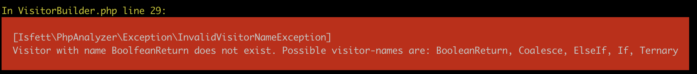

# Most Used Conditions

This command is inspired by Kent Beck's Medium-Article [Conditions Are Power-Law Distributed: An Example](https://medium.com/@kentbeck_7670/conditions-are-power-law-distributed-an-example-61fa4e0d3500).

## Story

I wanted to inspect all conditions in our project, checking for magic numbers and magic strings, as well as possible inconsistencies between equal (`==`) and identity (`===`) operators and their effect on different types (for example `!$user` instead of `null === $user`).
 
By trying to get all distinct `if`, `elseif` and `else if` conditions in different projects and grouping them by frequency of occurrence, my command ended up looking like `grep -R --include='*.php' --exclude-dir=vendor --exclude-dir=.idea 'if' . | perl -nle 'print $2 if /. (else)*?\s?if\s?\((.*)\)(.*){/,' | sort | uniq -c | sort -rn | sed --expression="s/ [0-9]\+ /&;/g" > ~/conditions.csv`. I realized that looking for if's and elseif's was not the only thing I was interested in, so I wrote a PHP implementation (this command).

This command gives you much more control. You can also use it to check ternaries, null coalescing operators and functions returning booleans.

While writing this command I found out that I did not only want to check the original conditions, but I wanted to know each part of an isset itself. Later I wanted to split conditions by `&&` and `||`. As I was adding more and more post-processors and checking the conditions, I also decided to remove some parts (like casts or assignments). And here we are now.


### With this command you can:

- declare which directory (recursive) you want to inspect
- change the suffixes (default is just *.php)
- exclude directories/files/patterns
- whitelist patterns (if you just want to check one/some file/s)
- declare which conditions are interesting (like: only `if` or `if` and `elseif`, just `elseif`, just ternary or coalescing operators, see [Visitors](#visitors))
- post-process conditions (like split isset or by logical operators, remove assignments, see [Processors](#processors))
- activate flip-checking (maybe you want to check which conditions are not well-written in yoda form)
- exclude conditions with less than n occurrences
- generate a csv (to plot graphs in [Excel](#create-a-log10-graph-in-excel) or gplot)

### Syntax

```shell script
# cloned repository, maybe via composer global require
bin/php-analyzer most-used-conditions [--options] directory

# phar
php-analyzer.phar most-used-conditions [--options] directory
```

If you omit the directory it will use the current working directory. You can use absolute or relative paths.

### Options

- `--excludes` to exclude directories. These must be relative to the source. Comma-separated list, for example: `--excludes=vendor,var`
- `--exclude-paths` to exclude paths. This option expects a comma-separated list. The list items could be a string or regexp, for example: `--exclude-paths=some/file.txt,some\/*\/dir`
- `--exclude-files` to exclude files. This option expects a comma-separated list. The list items could be a regexp, a [glob](https://www.php.net/glob) or string, for example: `--exclude-files=*Test.php`
- `--include-files` to include only specific files. This option expects a comma-separated list. The list items could be a regexp, a [glob](https://www.php.net/glob) or string. This is useful if you just want to inspect one to n files, for example `--include-files=test.php`
- `--suffixes` to change the suffixes of files getting inspected. The default is `php`, but maybe you want to add `phtml`, with: `--suffixes=php,phtml`
- `--visitors` to choose which conditions should be considered, see [Visitors](#visitors). The default is `If,ElseIf,Ternary`. If you just want to add conditions from if and elseif statements, you would use `--visitors=If,ElseIf`
- `--processors` to select how to post-process discovered conditions, see [Processors](#processors). The default is none, i.e. your conditions will be added in the form they appear in your source-code.
- `--sort` to determine the sorting direction. The list is sorted by the number of occurrences in the source code. The default sorting direction is `asc`. Change it to descending with `--sort=desc`.
- `--max-entries` to show only the n most frequent entries. The default is none (show all conditions). To just show the five highest: `--max-entries=5`
- `--max-occurrences` to limit the number of occurrences (i.e. relative filename + line number) per condition. The default is none (show all occurrences). If you just want to see "some" add `--max-occurrences=5`.
- `--min-occurrences` to limit the number of conditions by only showing conditions that have more occurrences in the source-code than the threshold. For example `--min-occurrences=5` will ignore all conditions occurring four or fewer times in your source code.
- `--with-flip-check` enables flip checking, see [Flip-Check](#flip-check).
- `--without-occurrences` will hide the filenames and line numbers of the conditions from the final output.
- `--without-flags` will hide the "flags" like `flipped` when `--with-flip-check` is enabled.
- `--without-affected-by-processor` will hide the information which Processors post-processed a condition.
- `--with-csv` will export the resulting table to a csv (comma-separated). Add a filepath as the value (absolute or relative) and make sure you have writing permission with the current user. Example `--with-csv=output.csv` will create an output.csv file in the current working directory.
- `--csv-delimiter-semicolon` will change the delimiter from the csv to semicolon (;)

### Visitors
For example we have some code like [this](examples/MostUsedConditions/visitors.php):

```php
<?php
if(date('Y') === 2019) {
    echo '2019!!!';
} elseif (date('Y') === 2018) {
    echo '2018!!!';
} elseif (date('Y') === 2017) {
    echo '2017!!!';
}

if(   date("Y") === 2019) {
    // do something
}

$page = isset($_GET['page']) ? $_GET['page'] : 1;

$page = $_GET['page'] ?? 1;

function isAnonymous(?User $user): bool
{
    return null === $user;
}
```

The following Visitors are available:
- `If`: This Visitor will collect all conditions inside if-statements. In the above example, it would just add `date('Y') === 2019` twice.
- `ElseIf`: This Visitor will collect all conditions inside elseif-statements. In the above example, it would add `date('Y') === 2018` and <br/>`date('Y') === 2017`.
- `Ternary`: This Visitor will collect all conditions on the left side of a ternary operator. In the above example, it would add `isset($_GET['page'])`.
- `Coalesce`: This Visitory behaves much like Ternary, in that its left side will be collected. In the above example, that would be `$_GET['page']`.
- `BooleanReturn`: (experimental) This Visitor will collect return statements without the `return` keyword in methods that have :bool as return type (not docblock). In the above example, that would be `null === $user`.

**Important:** This tool uses a php-parser and ignores different code-styles, so it doesn't matter if you are using single-quotes or double-quotes, add different types or amount of whitespaces and so on.

You can combine Visitors, use all or just one with a comma-separated list, like `--visitors=If,ElseIf,Ternary` or `--visitors=Coalesce`.

If you mistype the name of a Visitor, you will raise an Exception which will list all possible names. Visitor names are case-sensitive.



### Processors

You can combine Processors. Just add them to a comma-seperated list, like <br>`--processors=SplitIsset,SplitLogicalOperator`. The order of Processors is important. Using the provided example, processing would start with the SplitIsset and then execute SplitLogicalOperator. Your results might change if you change the order of the Processors.

You also can use none of the Processors (default).

If you mistype the name of a Processor, you will raise an Exception which will list all possible names. Processor names are case-sensitive.


#### SplitIsset
This Processor will split your isset conditions if there is more than one parameter inside. See [this source code](examples/MostUsedConditions/splitissetprocessor.php):

```php
<?php
if (isset($_GET['user'], $_GET['user']['name'])) {
    // do something
}
```

The SplitIsset Processor will create two new conditions and delete the old one. The new conditions will look like `isset($_GET['user']` and `isset($_GET['user']['name'])` and count both as 1.

`php bin/php-analyzer most-used-conditions --without-affected-by-processors --visitors=If --processors=SplitIsset --include-files=splitissetprocessor.php`


#### SplitLogicalOperator
This Processor will split your conditions by logical operators. To be precise, it will split them by `&&`, `||`, `and` and `or`. If there is a `!` outside, this will be added to both parts of the condition. See [this source code](examples/MostUsedConditions/splitlogicaloperatorprocessor.php):

```php
<?php
$a = 14;
if (13 === $a || 14 === $a) {
    // do something
}

if (!(13 === $a && 15 === $a)) {
    // do something else
}
```

The SplitLogicalOperator Processor will split the first if to `13 === $a` and `14 === $a`.
The second if will be split to `!13 === $a` and `!15 === $a`.

`php bin/php-analyzer most-used-conditions --without-affected-by-processors --visitors=If --processors=SplitLogicalOperator --include-files=splitlogicaloperatorprocessor.php`


#### NegateBooleanNot
This Processor will negate all comparison operators when it's negated from outside. See [this source code](examples/MostUsedConditions/negatebooleannotprocessor.php):

```php
<?php
$a = 14;
if (!($a === 13)) {
    // do something
}

if (!($a !== 14)) {
    // do something else
}

if (!($a < 13)) {
    // do something else
}
```

The NegateBooleanNot Processor will change the first if to `$a !== 13`, the second to `$a === 14` and the last to `$a > 13`. This Processor is especially useful in combination with the [SplitLogicalOperator](#splitlogicaloperator) Processor from above, but remember to add this Processor into the list _after_ the SplitLogicalOperator.

`php bin/php-analyzer most-used-conditions --without-affected-by-processors --visitors=If --processors=NegateBooleanNot --include-files=negatebooleannotprocessor.php`


#### RemoveAssignment
This Processor will remove assignments in your conditions. See [this source code](examples/MostUsedConditions/removeassignmentprocessor.php):

```php
<?php
if ($this->getUser()) {
    // do something
}

if ($user = $this->getUser()) {
    // do something else
}
```

You want to know that the condition from $this->getUser() is used twice, but normally the conditions in the example would be counted separately. This Processor will remove `$user = ` from the second condition and instead count 2 for `$this->getUser()`.

`php bin/php-analyzer most-used-conditions --without-affected-by-processors --visitors=If --processors=RemoveAssignment --include-files=removeassignmentprocessor.php`


#### RemoveDuplicateBooleanNot
This Processor removes duplicate negations. If you have a complex condition, and split it off, it could be possible for the printed condition to be something like `!!$user`. If you use this Processor and the Processors [SplitLogicalOperator](#splitlogicaloperator) and [NegateBooleanNot](#negatebooleannot) together on [this source code](examples/MostUsedConditions/removeduplicatebooleannotprocessor.php):

```php
<?php
$user = null;
if (!(30 === date('d') && !(null === $user))) {
    // do something
}
```

...then it will print `null === $user` (instead of `!!null === $user`).

`php bin/php-analyzer most-used-conditions --without-affected-by-processors --visitors=If --processors=SplitLogicalOperator,RemoveDuplicateBooleanNot --include-files=removeduplicatebooleannotprocessor.php`

#### RemoveSingleFullyQualifiedName
This Processor will ignore backslashes from fully qualified name functions or class names (e.g. new \DateTime), because maybe you don't use them or import a class. Codestyle can change often. See [this source code](examples/MostUsedConditions/removesinglefullyqualifiednameprocessor.php):

```php
<?php
if (strtolower('Chris') === 'chris') {
    // hey chris
}

if (\strtolower('Chris') === 'chris') {
    // chris again :o
}
```

The RemoveSingleFullyQualifiedName-Processor will count the conditions from the example as one (`strtolower('Chris') === 'chris'` twice), whereas without the Processor the command would count the conditions separately (`strtolower('Chris') === 'chris'` once and `\strtolower('Chris') === 'chris'` once).

`php bin/php-analyzer most-used-conditions --without-affected-by-processors --visitors=If --processors=RemoveSingleFullyQualifiedName --include-files=removesinglefullyqualifiednameprocessor.php`


#### RemoveCast
This Processor will remove any (cast)-casts (like `(int)`) from your conditions. I saw this in some legacy applications. See [this source code](examples/MostUsedConditions/removecastprocessor.php):

```php
<?php

$someReturnValue = '123';
if ((int) $foo === 123) {
    // found numeric 123
}
```

The RemoveCast-Processor will count the condition from the example code as though it had been supplied without (int).

`php bin/php-analyzer most-used-conditions --without-affected-by-processors --visitors=If --processors=RemoveCast --include-files=removecastprocessor.php`


### Flip-Check

If you supply `--with-flip-check`, the command will try to swap the arguments of `==`, `!=`, `===` and `!==` and check if the flipped condition already exists. If yes, it will mark it with a `flipped`-flag. See [this source code](examples/MostUsedConditions/flipcheck.php):

```php
<?php
if(date('Y') === 2019) {
    echo '2019!!!';
}

if (2019 === date('Y')) {
    echo '2019!!!';
}
```

Normally the command would count both conditions in the example code separately. With the option `--with-flip-check`, the second condition would instead be flipped and count as another occurrence of the first condition.

You can see the `flipped`-flag after the second occurrence. If you want to hide that information, add the option `--without-flags`.

`php bin/php-analyzer most-used-conditions --without-affected-by-processors --visitors=If --with-flip-check --include-files=flipcheck.php`


### Create a log(10) graph in Excel

- Open the csv and save it to xlsx.
- Select rows A and B and insert a `Scatter (XY)` graph.

Your graph should look similar to:


- Left-click on the x-axis to select the axis, then right-click and select `format axis`.
- Select `logarithmic scale` on the sidebar, then select `10`.
- Repeat for the y-axis.

Your log(10) graph should look similar to:

