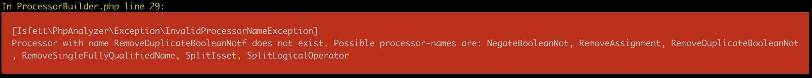
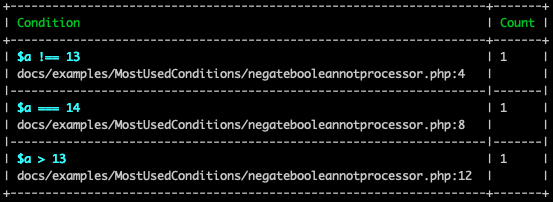

# Most Used Conditions

This command is inspired by Kent Beck's Medium-Articel [Conditions Are Power-Law Distributed: An Example](https://medium.com/@kentbeck_7670/conditions-are-power-law-distributed-an-example-61fa4e0d3500).

## Story
I wanted to inspect the conditions in our project, checking for magic numbers and magic strings, maybe inconsistency of equal (`==`) and identical (`===`) and different types (for example `!$user` instead of `null === $user`)
 
By trying to get all if's in different projects my command ended up like `grep -R --include='*.php' --exclude-dir=vendor --exclude-dir=.idea 'if' . | perl -nle 'print $2 if /. (else)*?\s?if\s?\((.*)\)(.*){/,' | sort | uniq -c | sort -rn | sed --expression="s/ [0-9]\+ /&;/g" > ~/conditions.csv`. I realized that just looking for if's and elseif's is not everything I'm interested in, so I wrote an PHP-Implementation which gives you much more control.

By writing this command I found out that I don't want to check the original conditions on some time. I wanted to know each part in an isset itself, later I wanted to split `&&` conditions. While adding more and more post-processors and checking the conditions I decided to remove some parts, like casts or assignments. And here we are now.


### With this command you can:
- Declare which directory (recursive) you want to inspect
- Change the suffixes (default is just *.php)
- Exclude dirs/files/patterns
- Whitelist patterns (if you just want to check one file)
- Declare which conditions are interesting (like: If or If and ElseIf, see [Visitors](#visitors))
- Post-process conditions (like split issets or by logical operators, remove assignments, see [Processors](#processors))
- Activate Flip-Checking
- Exclude conditions with less than n occurrences
- generate a csv (to plot graphs in excel or gplot)

### Syntax
```shell script
# cloned repository, maybe via composer global require
bin/php-analyzer most-used-conditions [--options] directory

# phar
php-analyzer.phar most-used-conditions [--options] directory
```

If you miss directory it will use the current working directory. You can use absolute or relative paths.

### Options
- `--excludes` for excluding directories. Must be relative to source. Comma-separated list, for example: `--excludes=vendor,var`
- `--exclude-paths` for excluding paths. Comma-separated list, items could be a string or regexp, for example: `--exclude-paths=some/file.txt,some\/*\/dir`
- `--exclude-files` for excluding files. Comma-separated list, items could be a regexp, a [glob](https://www.php.net/glob) or string, for example: `--exclude-files=*Test.php`
- `--include-files` for just including specific files. Comma-separated list, items could be a regexp, a [glob](https://www.php.net/glob) or string. Useful if you just want to inspect one to n files, for example `--include-files=test.php`
- `--suffixes` for change the suffixes of files getting inspected. Default is `php`, but maybe you want to add phtml, with: `--suffixes=php,phtml`
- `--visitors` for which conditions should be added, see [Visitors](#visitors). Default is `If,ElseIf,Ternary`, if you just want to add conditions from if and elseif this would be `--visitors=If,ElseIf`
- `--processors` for post-process your conditions with different tasks, see [Processors](#processors). Default none, your conditions will be added like they are in your source-code.
- `--sort` for sorting-direction by the number of occurrences in the source code. Default is `asc`, change to desc with `--sort=desc`
- `--max-entries` for just showing the highest n entries. Default none, show all conditions. To just show the five highest `--max-entries=5`
- `--max-occurrences` for limiting the number of occurrences per condition. Default none, show all occurrences (relative filename + line number). If you just want to see "some" add `--max-occurrences=5`
- `--min-occurrences` for limiting the number of conditions and just show conditions with more occurrences in source-code than treshold. For example `--min-occurrences=5` just will ignore all conditions with four or less times in your source code
- `--with-flip-check` enables flip check, see [Flip-Check](#flip-check)
- `--without-occurrences` will hide all occurrences of the conditions and just print the table without any
- `--with-csv` will export the result table to a csv (comma-separated). Add a filepath as value (absolute or relative) and make sure you have write rights with the current user. Example `--with-csv=output.csv` will create a output.csv file in the current working directory
- `--csv-delimiter-semicolon` will change the delimiter from the csv to semicolon (;)


### Visitors
For example we have some code like [this](examples/MostUsedConditions/visitors.php):
```php
<?php
if(date('Y') === 2019) {
    echo '2019!!!';
} elseif (date('Y') === 2018) {
    echo '2018!!!';
} elseif (date('Y') === 2017) {
    echo '2017!!!';
}

if(   date("Y") === 2019) {
    // do something
}
x
$page = isset($_GET['page']) ? $_GET['page'] : 1;

$page = $_GET['page'] ?? 1;

function isAnonymous(?User $user): bool
{
    return null === $user;
}
```
The following visitors are available:
- `If`: Will add all conditions inside if-statements, here it will just add `date('Y') === 2019` twice
- `ElseIf`: Will add all conditions inside elseif-statements, here it will add `date('Y') === 2018` and <br/>`date('Y') === 2017`
- `Ternary`: This visitor will add all conditions on the left side of a ternary, here it will add `isset($_GET['page'])`
- `Coalesce`: Like Ternary, left side will be added, here `$_GET['page']`
- `BooleanReturn`: (experimental) Will add the return statements without `return` in methods that have :bool as return type (not docblock), here `null === $user`

**Important:** This tool uses a php-parser, and ignore different code-styles. So it's no matter if using single- or double-quotes, add different types or amount of whitespaces etc.

You can combine visitors, use all or just one with a comma-separated list, like `--visitors=If,ElseIf`.

If you mistype a name of a visitor, you will raise an Exception including all possible names (case-sensitive).


### Processors

You can combine processors, just add them to a comma-seperated list, like <br>`--processors=SplitIsset,SplitLogicalOperator`. The order of processors is important, in the current case it will start with the SplitIsset and then the SplitLogicalOperator. Maybe your results will change if you change the order of the processors.

You also can use none of the processors (default).

If you mistype a name of a processor, you will raise an Exception including all possible names (case-sensitive).



#### SplitIsset
This processor will split your isset conditions if there is more than one parameter inside. See [this](examples/MostUsedConditions/splitissetprocessor.php) source-code:
```php
<?php
if (isset($_GET['user'], $_GET['user']['name'])) {
    // do something
}
```
The SplitIsset-Processor will create two new conditions and delete the old one. The new conditions will look like `isset($_GET['user']` and `isset($_GET['user']['name'])` and count both as 1.


#### SplitLogicalOperator
This processor will split your conditions by logical operators, to be exact: `&&`, `||`, `and` and `or`. If there is a `!` outside, this will be added to both parts of the condition. See [this](examples/MostUsedConditions/splitlogicaloperatorprocessor.php) source-code:
```php
<?php
$a = 14;
if (13 === $a || 14 === $a) {
    // do something
}

if (!(13 === $a && 15 === $a)) {
    // do something else
}
```
The SplitLogicalOperator-Processor will split the first if to `13 === $a` and `14 === $a`.
The second if will be split to `!13 === $a` and `!15 === $a`.


#### NegateBooleanNot
This processor will negate all comparison operators when it's negated from outside. See [this](examples/MostUsedConditions/negatebooleannotprocessor.php) source-code:
```php
<?php
$a = 14;
if (!($a === 13)) {
    // do something
}

if (!($a !== 14)) {
    // do something else
}

if (!($a < 13)) {
    // do something else
}
```
The NegateBooleanNot-Processor will change the first if to `$a !== 13`, the second to `$a === 14` and the last to `$a > 13`. This processor is very nice in combination with [SplitLogicalOperator](#splitlogicaloperator) from above, but make sure to add this processor in the list after the SplitLogicalOperator



#### RemoveAssignment
This processor will remove assignments in your conditions. See [this](examples/MostUsedConditions/removeassignmentprocessor.php) source-code:
```php
<?php
if ($this->getUser()) {
    // do something
}

if ($user = $this->getUser()) {
    // do something else
}
```
You want to know that the condition from $this->getUser() is used twice, but normally it would be counted as one plus one. This processor will remove `$user = ` from the second condition and will count 2 for `$this->getUser()`.


#### RemoveDuplicateBooleanNot
This processor removes duplicate negations. So if you have an complex condition, and split it off, it could be possible in the printed condition is something like `!!$user`. You can achieve this with [this](examples/MostUsedConditions/removeduplicatebooleannotprocessor.php) source-code and the [SplitLogicalOperator-Processor](#splitlogicaloperator) and [NegateBooleanNot-Processor](#negatebooleannot) together
```php
<?php
$user = null;
if (!(30 === date('d') && !(null === $user))) {
    // do something
}
```
If you add the RemoveDuplicateBooleanNot-Processor, it will print `null === $user` and removes the `!!`.

#### RemoveSingleFullyQualifiedName
This processor will ignore backslashes from fully qualified name functions or class name (e.g. new \DateTime), because maybe you don't use them or import an class. Codestyle can change often. See [this](examples/MostUsedConditions/removesinglefullyqualifiednameprocessor.php) source-code:
```php
<?php
if (strtolower('Chris') === 'chris') {
    // hey chris
}

if (\strtolower('Chris') === 'chris') {
    // chris again :o
}
```
The RemoveSingleFullyQualifiedName-Processor will count the condition as 2, without the processor it will count both as single condition.


#### RemoveCast
This processor will any (cast)-casts (like `(int)`). I saw this in some legacy applications. See [this](examples/MostUsedConditions/removecastprocessor.php) source-code:
```php
<?php

$someReturnValue = '123';
if ((int) $foo === 123) {
    // found numeric 123
}
```
The RemoveCast-Processor will count the condition as 1, but without (int).


### Flip-Check
- with `--with-flip-check` the command will try to swap both sides of `==`, `!=`, `===` and `!==` and check if it already exists. If yes it will mark it with an `(flipped)`-flag. See [this](examples/MostUsedConditions/flipcheck.php) source-code:
```php
<?php
if(date('Y') === 2019) {
    echo '2019!!!';
}

if (2019 === date('Y')) {
    echo '2019!!!';
}
```
Normally the command will count both conditions as found once, with the option `--with-flip-check` it will be count as twice and flip the second condition.


### Create a log(10) graph in Excel
- Open the csv and save it to xlsx
- Select rows A and B and insert a `Scatter (XY)`-Graph

Your graph should look similar to:


- Left-Click on x-axis to select the axis, then right-click and select `format axis`.
- Select in the sidebar `logarithmic scale` and select `10`
- Repeat for y-axis

Your log(10) graph should look similar to:

